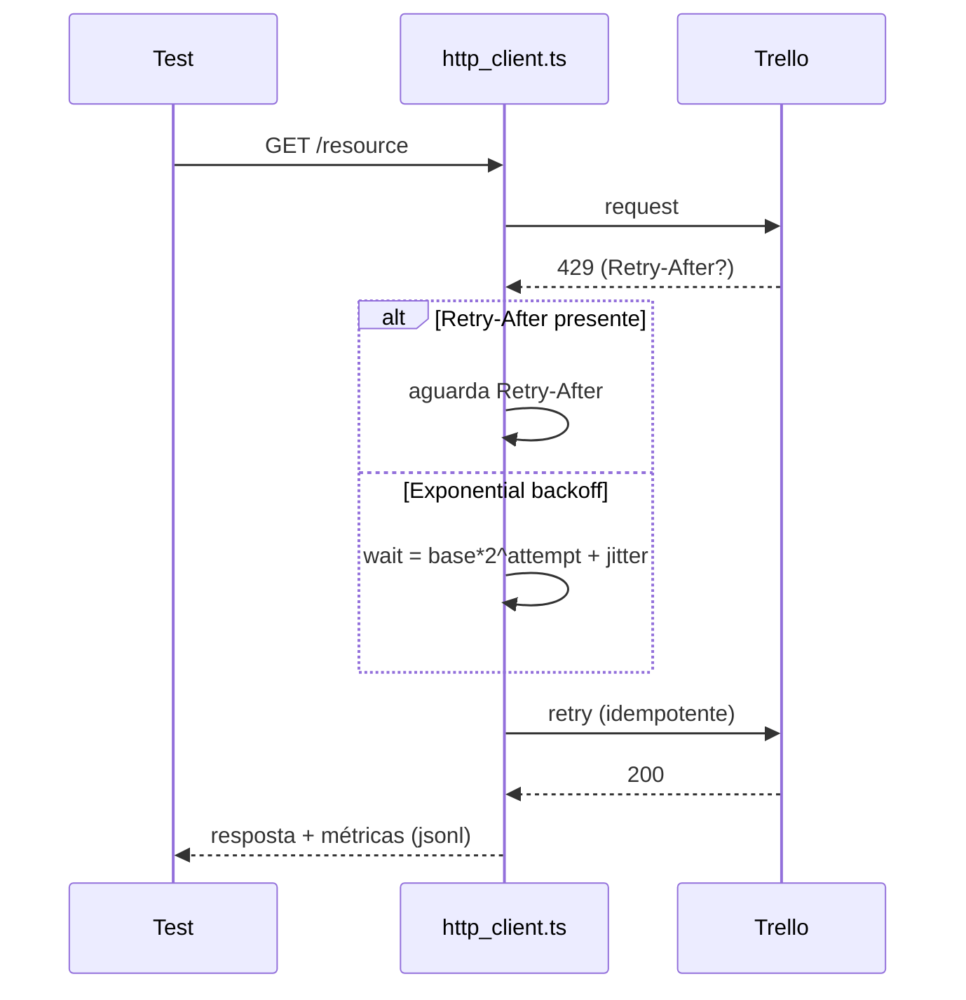

# 🚀 Testes de API – Trello Management (Playwright)


[](https://github.com/brunosalzani/trello-management-api-playwright/actions/workflows/ci.yml)
[](https://github.com/brunosalzani/trello-management-api-playwright/actions/workflows/nightly-perf.yml)
[](LICENSE)
[](#)
[](https://github.com/brunosalzani/trello-management-api-playwright/actions/workflows/mutation.yml)
[](https://github.com/brunosalzani/trello-management-api-playwright/actions/workflows/pr.yml)

Criado por: Bruno Salzani

Automação de testes de API para o Trello (Boards, Lists, Cards), com SLAs por endpoint, métricas e qualidade de nível produção. O foco é confiabilidade, leitura e execução reprodutível em diferentes ambientes (online/offline).

## Requisitos

- Node 20+
- Conta Trello com Key/Token

## 🎯 Objetivo do Projeto

Garantir a qualidade dos principais fluxos da API:

- Boards: criar, consultar e deletar
- Lists: criar e arquivar
- Cards: criar, mover e comentar
- Cenários negativos relevantes e smoke de performance

Foco em:

- SLAs controlados por endpoint e gates de p95 no CI
- Métricas por requisição e sumários por execução
- Reprodutibilidade (modo offline) e relatórios claros

## 🧠 Estratégia e Arquitetura

Camadas principais:

1. Cliente HTTP próprio ([utils/http_client.ts](file:///d:/Projects/trello-management-api-playwright/utils/http_client.ts)) com retry/backoff para 429, correlação (RUN_ID/x-request-id), registro de métricas e injeção de caos opcional.
2. Helpers de API ([utils/api_helper.ts](file:///d:/Projects/trello-management-api-playwright/utils/api_helper.ts)) que montam payloads e validam contratos essenciais via Zod.
3. Suites por domínio ([tests/functional](file:///d:/Projects/trello-management-api-playwright/tests/functional)) com tags [BOARDS], [LISTS], [CARDS], [FUNCTIONAL], [NEGATIVE] e projeto PERF opcional.
4. Teardown global ([tests/global-teardown.ts](file:///d:/Projects/trello-management-api-playwright/tests/global-teardown.ts)) para limpeza de dados e agregação de métricas em `metrics-summary.json`.
5. Observabilidade histórica: exportador CSV + push opcional para InfluxDB ([scripts/export-metrics.ts](file:///d:/Projects/trello-management-api-playwright/scripts/export-metrics.ts)).
6. Contratos consumer-side: Pact (POST/GET Boards) ([scripts/pact-generate.ts](file:///d:/Projects/trello-management-api-playwright/scripts/pact-generate.ts)).

Diretrizes técnicas:

- Seletores por domínio via tags; asserts descritivos com contratos mínimos
- Sincronização nativa do Playwright; sem “esperas mágicas”
- Execução headless por padrão; relatório HTML para inspeção

## 🔄 Fluxos Cobertos

1. Boards
   - Criar, consultar, deletar
   - Negativo: deletar board já deletado; criar board com nome vazio
2. Lists
   - Criar, arquivar
   - Negativo: arquivar lista inexistente
3. Cards
   - Criar, mover, comentar
   - Negativo: criar/mover com list inválida; comentar em card inexistente
4. Performance
   - Smoke rápido de criação/remoção de board (projeto PERF)

## 📁 Estrutura do Projeto

```bash
tests/
├── functional/
│   ├── boards.spec.ts
│   ├── lists.spec.ts
│   └── cards.spec.ts
├── perf/
│   └── smoke.perf.ts
├── global-setup.ts
└── global-teardown.ts
utils/
├── http_client.ts
├── api_helper.ts
└── contracts.ts
scripts/
├── export-metrics.ts        # CSV + Influx push (opcional)
├── pact-generate.ts         # contrato consumer (Boards)
├── quick-check.ts           # POST /boards
├── enforce-sla.js           # gates p95 (CI)
└── openapi-security-lint.ts # lint de segurança do OpenAPI (opcional)
test-results/                # junit.xml, metrics.jsonl, metrics-summary.json/csv
pacts/                       # arquivos Pact gerados
```

## ⚙️ Funcionalidades Automatizadas

- SLAs por endpoint e gates de p95 na pipeline
- Métricas por requisição (jsonl) e sumário por rota (count/min/max/avg/p95)
- Retry/backoff apenas para GET/DELETE com 429 (respeita Retry-After)
- Chaos Injection opcional para exercitar resiliência
- Modo offline (MOCK_API=1) com cliente in-memory
- Contratos essenciais validados em runtime com Zod
- Contrato consumer Pact para interações críticas (POST/GET Boards)

## 🧪 Boas Práticas

- Asserts diretos e mensagens claras
- Contratos mínimos (id, idBoard, idList, closed) validados com Zod
- Sem waits arbitrários; tempos cronometrados nos pontos-chave dos testes
- Dados de teste isolados por RUN_ID e limpeza automática no teardown

## Configuração

1. Copie `.env.example` para `.env` e preencha:
   - `TRELLO_KEY`, `TRELLO_TOKEN`
   - Opcional: `SLA_MS` ou SLAs por endpoint (ver abaixo)
2. Instale deps:
   - `npm install`

## Executando

- Todos: `npm test`
- Funcionais: `npm run test:functional`
- Negativos: `npm run test:negative`
- Perf (opcional): `npm run test:perf` (`ENABLE_PERF=1`)
- Relatório HTML: `npm run test:report`
- CI local (agregado): `npm run ci`
- Verificação completa (qualidade + testes): `npm run verify`

## Scripts Úteis

- `test:functional` / `test:negative`: executam por projeto
- `test:functional:slow`: SLAs mais altos por endpoint (útil em redes lentas)
- `test:negative:slow`: SLAs globais mais altos
- `test:perf`: ativa o projeto PERF com `PERF_WORKERS` e `PERF_REPEAT` configuráveis por env
- `test:smoke:boards` / `test:smoke:cards`: filtra cenários por domínio rapidamente
- `mutation`: executa StrykerJS (mutation testing) nos utilitários
- `token:revoke`: revoga um token Trello (usa TRELLO_KEY + TOKEN_TO_REVOKE ou TRELLO_TOKEN)
- `quick-check`: faz uma chamada simples (POST /boards) e imprime status/preview
- `metrics:export` / `metrics:push`: gera CSV de métricas e envia para InfluxDB (se INFLUX_* definidos)
- `pact:generate`: gera contrato consumer Pact para Boards (POST/GET)
- `security:openapi:lint`: baixa o OpenAPI (OPENAPI_URL) e roda Spectral; ignora caso indisponível
- `verify`: roda lint, typecheck e a suíte completa de testes

## Variáveis de Ambiente

- Credenciais:
  - `TRELLO_KEY`, `TRELLO_TOKEN`
- Observabilidade:
  - `DEBUG_HTTP` (1 para logs detalhados)
  - `RUN_ID` (opcional; propagado como prefixo do `x-request-id`)
- Chaos Testing:
  - `ENABLE_CHAOS` (1 para ativar)
  - `CHAOS_RATE` (padrão 0.05), `CHAOS_RATE_GET|POST|PUT|DELETE` (por método)
  - `CHAOS_INCLUDE` e `CHAOS_EXCLUDE` (lista de regex separadas por `;`, avaliadas sobre `METHOD /path` ou `/path`)
  - `CHAOS_STATUSES` (ex.: `429,500`), controla códigos injetados
  - `CHAOS_PRESET` (ex.: `cards,lists,boards`) aplica filtros por domínio automaticamente
  - Preset especial: `CHAOS_PRESET=critical` (focado em criação/mutação):
    - Boards: `POST /1/boards`, `DELETE /1/boards/{id}`
    - Lists: `POST /1/lists`, `PUT /1/lists/{id}/closed`
    - Cards: `POST /1/cards`, `PUT /1/cards/{id}`, `POST /1/cards/{id}/actions/comments`
- SLAs funcionais (tempo por operação):
  - Global: `SLA_MS` (ms)
  - Por endpoint: `SLA_MS_CREATE_BOARD`, `SLA_MS_GET_BOARD`, `SLA_MS_DELETE_BOARD`, `SLA_MS_CREATE_LIST`, `SLA_MS_ARCHIVE_LIST`, `SLA_MS_CREATE_CARD`, `SLA_MS_MOVE_CARD`, `SLA_MS_COMMENT_CARD`
- Gates de performance (p95 na pipeline):
  - `SLA_P95_CREATE_BOARD`, `SLA_P95_GET_BOARD`, `SLA_P95_DELETE_BOARD`, `SLA_P95_CREATE_LIST`, `SLA_P95_ARCHIVE_LIST`, `SLA_P95_CREATE_CARD`, `SLA_P95_MOVE_CARD`, `SLA_P95_COMMENT_CARD` (fallback `SLA_MS`)
- Projeto Perf:
  - `ENABLE_PERF` (1 para ativar)
  - `PERF_WORKERS` (padrão 3), `PERF_REPEAT` (padrão 5)
- Modo Offline:
  - `MOCK_API` (1 para usar cliente in-memory e rodar sem internet)
- Reexecução/Flaky:
  - `RETRIES` (padrão 1) reexecuta testes falhos; reporter marca como Flaky
- Drift Detection:
  - `OPENAPI_URL` (URL do OpenAPI do Trello para o job de drift)
  - `FAIL_ON_FLAKY` (1 para fazer o analyzer falhar se >3 flakies/semana)
  - Gates por projeto: `FLAKY_GATE_FUNCTIONAL`, `FLAKY_GATE_NEGATIVE`, `FLAKY_GATE_PERF` (falham se exceder no período analisado)

### Exemplos práticos

| Objetivo                                                   | Comando/Config                                                 |
| ---------------------------------------------------------- | -------------------------------------------------------------- |
| Rodar testes com logs HTTP                                 | `DEBUG_HTTP=1 npm test`                                        |
| Ajustar SLA global para 2500ms                             | `SLA_MS=2500 npm run test:functional`                          |
| Aumentar SLAs por endpoint (preset slow)                   | `npm run test:functional:slow`                                 |
| Ativar projeto perf com 4 workers e 8 repetições           | `ENABLE_PERF=1 PERF_WORKERS=4 PERF_REPEAT=8 npm run test:perf` |
| Definir run id customizado para correlação                 | `RUN_ID=pr-123 npm test`                                       |
| Aplicar gates p95 mais estritos (ex.: create board 1500ms) | `SLA_P95_CREATE_BOARD=1500 npm run test:functional`            |
| Rodar mutation testing local                               | `npm run mutation`                                             |
| Rodar completamente offline (cliente in-memory)            | `MOCK_API=1 npm test`                                          |
| Rodar offline (Windows PowerShell)                         | `$env:MOCK_API='1'; npm test`                                  |
| Ativar Chaos (5% falhas artificiais)                       | `ENABLE_CHAOS=1 npm test`                                       |
| Ajustar taxa de caos para 10%                              | `ENABLE_CHAOS=1 CHAOS_RATE=0.1 npm test`                        |
| Injetar caos só em GET de boards                           | `ENABLE_CHAOS=1 CHAOS_RATE_GET=0.2 CHAOS_INCLUDE='GET\\s+/1/boards.*' npm test` |
| Excluir criação de boards do caos                          | `ENABLE_CHAOS=1 CHAOS_EXCLUDE='/1/boards$' npm test`            |
| Injetar apenas 429                                         | `ENABLE_CHAOS=1 CHAOS_STATUSES=429 npm test`                    |
| Preset de caos só em Cards                                 | `ENABLE_CHAOS=1 CHAOS_PRESET=cards npm test`                    |
| Preset crítico (criação/mutação)                            | `ENABLE_CHAOS=1 CHAOS_PRESET=critical npm test`                 |
| Reexecução automática 1x (quarentena de flaky)             | `RETRIES=1 npm test`                                            |
| Analisar flakies da última semana                          | `npm run flaky:analyze`                                         |
| Gate de flaky por projeto (ex.: functional <= 0)           | `FLAKY_GATE_FUNCTIONAL=0 FAIL_ON_FLAKY=1 npm run flaky:analyze` |
| Rodar detecção de drift local                              | `npm run drift`                                                |

## SLAs

- Global: `SLA_MS` (ms)
- Por endpoint:
  - `SLA_MS_CREATE_BOARD`, `SLA_MS_GET_BOARD`, `SLA_MS_DELETE_BOARD`
  - `SLA_MS_CREATE_LIST`, `SLA_MS_ARCHIVE_LIST`
  - `SLA_MS_CREATE_CARD`, `SLA_MS_MOVE_CARD`, `SLA_MS_COMMENT_CARD`
- Preset “slow”:
  - `npm run test:functional:slow`
  - `npm run test:negative:slow`

### Como os SLAs funcionam

- Cada teste mede o tempo individual de cada operação (criar, mover, arquivar, etc.).
- O threshold é lido do ambiente com prioridade por endpoint; se ausente, usa `SLA_MS` e por fim 2000ms.
- Útil para ajustar expectativas por rota/ambiente (rede local, VPN, CI na nuvem).

## Métricas

- Por requisição: `test-results/metrics.jsonl`
- Sumário (gerado no teardown): `test-results/metrics-summary.json`
- Exportação histórica:
  - CSV consolidado: `npm run metrics:export` → `test-results/metrics-summary.csv`
  - Push opcional para InfluxDB v2: defina `INFLUX_URL`, `INFLUX_ORG`, `INFLUX_BUCKET`, `INFLUX_TOKEN` e rode `npm run metrics:push`
- Ativar logs HTTP: `DEBUG_HTTP=1`
  - Exemplo de saída: `[HTTP] GET /1/boards/abc -> 200 in 123ms`
- Correlação:
  - Defina `RUN_ID` opcionalmente; cada requisição recebe um `x-request-id` único (inclui o runId).
  - As métricas registram `runId` e `reqId` para facilitar troubleshooting.
- Em caso de erro HTTP, o cliente imprime um comando `curl` mascarado (sem expor segredos) no log do teste, facilitando reprodução local.

## Projetos/Tags

- Projects: functional, negative e perf (condicional `ENABLE_PERF=1`)
- Tags por domínio: `[BOARDS]`, `[LISTS]`, `[CARDS]`, além de `[FUNCTIONAL]`, `[NEGATIVE]`, `[PERF]`
  - Filtrar manualmente: `npx playwright test --grep "\\[CARDS\\]"`

## Chaos Injection (Resiliência)

- Com `ENABLE_CHAOS=1`, o cliente HTTP injeta aleatoriamente respostas `429`/`500` (~5% por padrão) antes da chamada real.
- GET/DELETE respeitam `retry-after` simulado, exercitando o backoff e a política de retry.
- Ajuste a taxa via `CHAOS_RATE` (0–1).

## Flaky Test Quarantine

- `retries` configurável via `RETRIES` (padrão 1).
- Reporter customizado grava `test-results/flaky.jsonl` e loga `[FLAKY] … passed on retry`.
- Analise a recorrência semanal: `npm run flaky:analyze` (use `FAIL_ON_FLAKY=1` para falhar em CI).
 - Integrado nos workflows (CI, PR, Nightly Perf) com upload do `flaky.jsonl`.

## Automated Drift Detection

- Script `npm run drift` baixa o OpenAPI do Trello (`OPENAPI_URL`) e compara campos essenciais com os Schemas Zod (Board/List/Card).
- Workflow semanal [.github/workflows/drift.yml](file:///d:/Projects/trello-management-api-playwright/.github/workflows/drift.yml) carrega o relatório como artefato.

## Arquitetura (alto nível)

```
Tests (Playwright)
 ├─ Functional/Negative [BOARDS|LISTS|CARDS]
 └─ Perf [PERF]
      ↓ chama helpers
utils/api_helper.ts
 ├─ Monta payloads + valida contratos essenciais
 └─ Encaminha para http_client
      ↓
utils/http_client.ts
 ├─ Requisições HTTPS puras (GET/POST/PUT/DELETE)
 ├─ Retry controlado (apenas 429 idempotentes)
 ├─ Correlação: runId + x-request-id por request
 ├─ Mapeamento de erros (400/401/403/404/429/5xx)
 └─ Registro de métricas (jsonl)
      ↓
tests/global-teardown.ts
 ├─ Limpa boards de teste (prefixo TEST_)
 └─ Agrega métricas → metrics-summary.json
```

## Rate Limit e Confiabilidade

- Requisições GET/DELETE possuem retry automático em `429` com backoff exponencial e jitter, respeitando `Retry-After` quando presente.
- POST/PUT não são reexecutados (evita duplicar criação/mutação).
- Erros tipados (`400`, `401/403`, `404`, `429`, `5xx`) facilitam asserts negativos.

## CI (GitHub Actions)

- Workflow pronto em [.github/workflows/ci.yml](file:///d:/Projects/trello-management-api-playwright/.github/workflows/ci.yml)
- Configure os secrets no repositório:
  - `TRELLO_KEY` e `TRELLO_TOKEN`
- Execução por SO (matriz):
  - Ubuntu e Windows (Windows marcado como continue-on-error para não quebrar o pipeline em asserts esporádicos de runtime)
- Concurrency/cancelamento de execuções obsoletas habilitado
- Artefatos publicados:
  - `test-results/junit.xml` (JUnit)
  - `test-results/metrics.jsonl` e `metrics-summary.json`
  - `playwright-report` (relatório HTML)
- Badge: substitua `OWNER/REPO` no topo deste README pelo seu repositório.
- Quality Gates: resumo de métricas no Job Summary e `scripts/enforce-sla.js` para falha por p95 acima do threshold.

### PR Fast Checks

- Workflow leve para PRs: lint + typecheck + smoke de Boards
- Arquivo: [.github/workflows/pr.yml](file:///d:/Projects/trello-management-api-playwright/.github/workflows/pr.yml)

### Job opcional de Performance

- Habilite com variável de repositório `ENABLE_PERF=1` (Settings → Secrets and variables → Actions → Variables).
- Opcionalmente ajuste:
  - `PERF_WORKERS` (padrão 3)
  - `PERF_REPEAT` (padrão 5)
- O job usa o projeto `perf` (tests/perf) e publica artefatos iguais aos demais.

## Mutation Testing (experimental)

- Configuração: [stryker.conf.json](file:///d:/Projects/trello-management-api-playwright/stryker.conf.json)
- Execução:
  - Local: `npm run mutation`
  - CI: workflow dedicado atualiza o badge em `assets/badges/mutation.svg`
- Relatórios:
  - HTML/Text nos artefatos do job (Stryker)
- Uso:
  - Mede eficácia dos testes internos; guia adição de casos nos helpers/cliente

## Test Strategy

- Documento: [docs/test-strategy.md](file:///d:/Projects/trello-management-api-playwright/docs/test-strategy.md)
- Cobre pirâmide, políticas (retry, SLAs, flakiness), observabilidade e ownership.

### Exemplo de Metrics Summary (Quality Gates)

```
# Metrics Summary
Generated: 2026-03-05T03:00:00.000Z
- POST /1/boards: count=5, avg=420ms, p95=610ms
- GET /1/boards/{id}: count=5, avg=180ms, p95=240ms
- PUT /1/cards: count=5, avg=350ms, p95=520ms
```

### Resiliência (429) – Diagrama



## Segurança

- `.env` está no `.gitignore`. Nunca versionar chave/token. Rotacione credenciais se necessário.
- Política em [SECURITY.md](file:///d:/Projects/trello-management-api-playwright/SECURITY.md)

## Observações (Windows)

- Em alguns ambientes Windows, após os testes, pode aparecer uma assert do runtime (libuv) mesmo com tudo passando. Não impacta os resultados.

## Contribuição

- Abra uma Issue usando os templates do repositório
- Envie PR seguindo o checklist do template
- Use mensagens claras; tags de teste já permitem execuções direcionadas
- Veja também: [CONTRIBUTING.md](file:///d:/Projects/trello-management-api-playwright/CONTRIBUTING.md)

## Licença

- MIT. Veja [LICENSE](file:///d:/Projects/trello-management-api-playwright/LICENSE)
